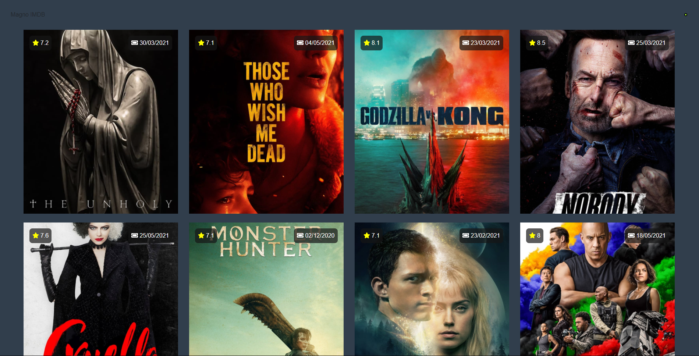
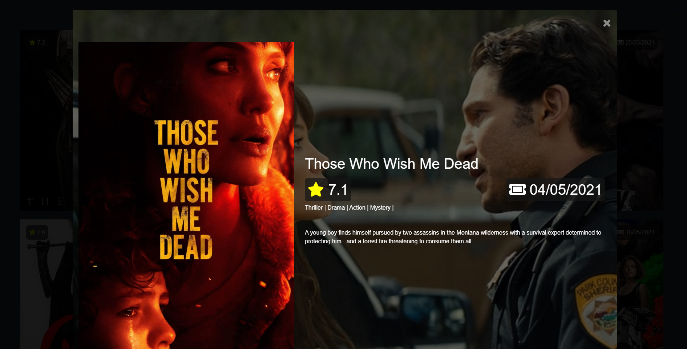

# IMDB-REACT




> Desafio técnico Front-end desenvolvido por Magno Guimarães.

## 🚀 Instalando

Para instalar e executar, siga estas etapas:

```
npm install
npm start
```

Build:
```
npm run build
```


## Demonstração:

- https://imdb-react.vercel.app/


## ☕ Descrição 
Para este projeto foi utilizado React.js e Redux, alguns Components do Bootstrap para auxiliar nos grids; <br><br>
Todos os dados (imagens, e textos) foram consumidos a partir da api (https://developers.themoviedb.org/3); <br><br>